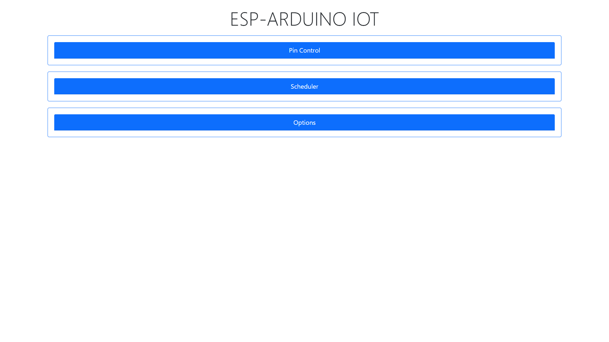
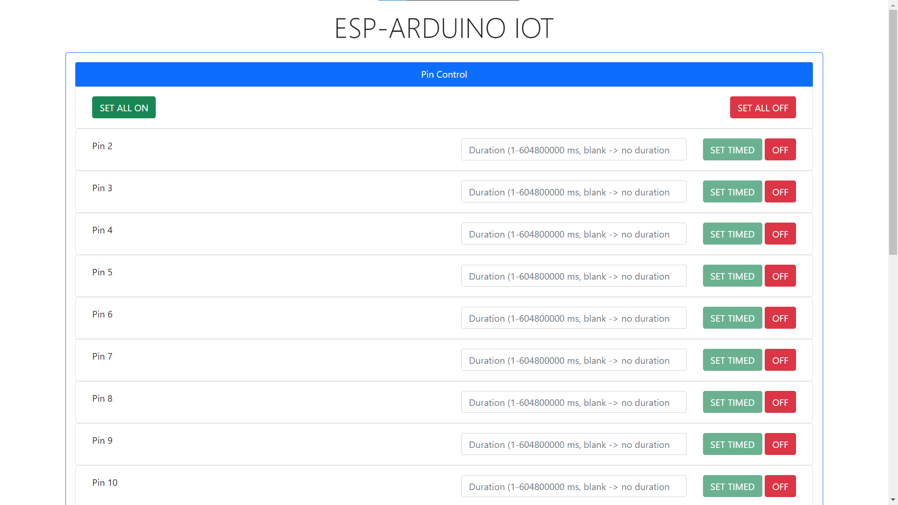
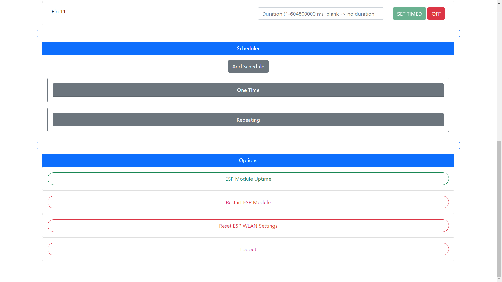

# ESP-Arduino-IOT

Using serial communication between Arduino and ESP8266 (because i use  ESP-01 and the GPIOs are limited and not practical to use)

**UPDATE**

Now can be used without arduino (esp8266 only)

**Features** 

* Supports control to all pins that specified in code (includes timing)
* Responsive web interface using [ESPAsyncWebServer](https://github.com/me-no-dev/ESPAsyncWebServer) (API is available for other platform)
* Supports scheduling (one time and repeating every day) and stored in onboard flash
* Easier WiFi control using [WiFiManager](https://github.com/tzapu/WiFiManager)

**Notes** 

* When compiling, use at least 512kB FS data  and use only lwIP v2 Lower Memory (Higher bandwidth version seems to be unstable, and lower memory version is fast enough)
* Don't be confused with .gzp extension. It is actually .gz file. This avoids auto downloading by external downloader, ex: IDM
* WiFi Manager and web interface credentials can be modified in code

**Screenshots**

